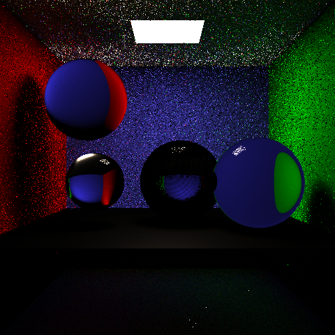

# CSE_168_Final_Project

Below is our project proposal, will be updated to formal project report after we finish the implementation. 

## CSE 168 Project Proposal - Photon Mapping

For our final project, we will implement photon mapping, which is a powerful technique for rendering realistic global illumination effect, such as caustics and diffuse lighting. Unlike standard path tracing, which traces rays from the eye into a scene, photon mapping mimics the  behavior of light by tracing photons emitted from light sources into the scene, and then using those photons to estimate global illumination effects. 

When we trace a photon from a light source, we check for intersections with objects in the scene, and by some calculations we can determine its contribution to the overall illumination. These photons are also stored in a data structure for efficient querying during rendering, and we will use a kd-tree for this. During the rendering process, direct lighting is calculated as in HW 2, but we also perform photon gathering to help estimate indirect lighting. We will query the stored photons using the kd-tree to find the nearby photons that contribute to the indirect lighting of the current point being shaded. 

We will use two photon maps: a caustics photon map and a global photon map. The former will be used to store photons that are emitted towards specular objects and hit diffuse surfaces while the latter will be used by emitting photons towards all objects.

Eventually, we hope to render a scene which has a glass Stanford bunny and glass teapot inside a Cornell box. For now, we are just working on getting photon mapping to work on a few glass spheres within the Cornell Box. 

Currently, we are trying to finish the implementation of the refraction object. We are encountering some issues with showing the transparency of the object and oversaturated colors.

Going forward, we still need to develop a data structure and also algorithms to store the photons into the kd-tree. Each photon will be represented as a an xyz coordinate, and the tree will be build by recursively dividing the photon set based on median values. We need to ensure that the kd-tree is perfectly balanced to optimized rendering speed. 

Our current progress: 

