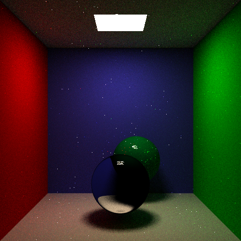
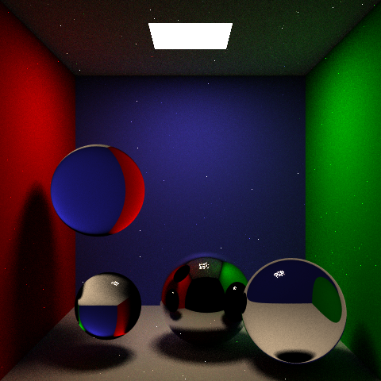

# CSE_168_Final_Project - Photon Mapping Report

Building off our proposal, we have successfully implemented refraction for our objects by setting the index of refraction to a value greater than 0.0. In our test cases, we used an index of refraction (IOR) of 0.97, which transformed our sphere into a glass object. Additionally, we implemented our KD-Tree and tracing algorithms, and we set up photon mapping, including the insertion of photons for both global and caustic mapping.

The global mapping works mostly fine, although there are some discrepancies in the radiance. Notice the differences in the images below:

The image on the left demonstrates that refraction works correctly on the glass object. The image on the right shows our global photon mapping, with an attempt to add soft radiance on top of our direct and indirect illumination.

Here are more examples with two objects and our dragon model:

The image on the right of the dragon model demonstrates how we have mapped our global photons on a more complicated object.

These examples illustrate the progress we have made in photon mapping and global illumination. However, there is still room for improvement in accurately capturing radiance, especially in complex scenes. The next steps will involve refining our photon mapping techniques and optimizing our KD-Tree structure to enhance the quality and realism of the rendered images.

Also :)
## Fixed progress from the proposal: 

#### NOTE: We really try on this project, please let us pass this class. Thank you for your help :))))) THANK YOU!

## CSE 168 Project Proposal - Photon Mapping

For our final project, we will implement photon mapping, which is a powerful technique for rendering realistic global illumination effect, such as caustics and diffuse lighting. Unlike standard path tracing, which traces rays from the eye into a scene, photon mapping mimics the  behavior of light by tracing photons emitted from light sources into the scene, and then using those photons to estimate global illumination effects. 

When we trace a photon from a light source, we check for intersections with objects in the scene, and by some calculations we can determine its contribution to the overall illumination. These photons are also stored in a data structure for efficient querying during rendering, and we will use a kd-tree for this. During the rendering process, direct lighting is calculated as in HW 2, but we also perform photon gathering to help estimate indirect lighting. We will query the stored photons using the kd-tree to find the nearby photons that contribute to the indirect lighting of the current point being shaded. 

We will use two photon maps: a caustics photon map and a global photon map. The former will be used to store photons that are emitted towards specular objects and hit diffuse surfaces while the latter will be used by emitting photons towards all objects.

Eventually, we hope to render a scene which has a glass Stanford bunny and glass teapot inside a Cornell box. For now, we are just working on getting photon mapping to work on a few glass spheres within the Cornell Box. 

Currently, we are trying to finish the implementation of the refraction object. We are encountering some issues with showing the transparency of the object and oversaturated colors.

Going forward, we still need to develop a data structure and also algorithms to store the photons into the kd-tree. Each photon will be represented as a an xyz coordinate, and the tree will be build by recursively dividing the photon set based on median values. We need to ensure that the kd-tree is perfectly balanced to optimized rendering speed. 

